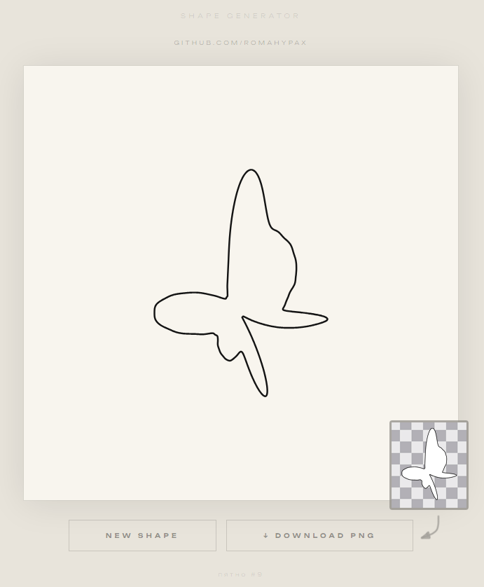

A simple HTML application for creating random shapes.

## You can try the application online here:
[Open Shape Generator](ТВОЯ_ССЫЛКА_GITHUB_PAGES)

## Preview

- **New Shape** — generates a new random shape every time the button is clicked.
- **Download PNG** — downloads the generated shape as a PNG image without the background.
